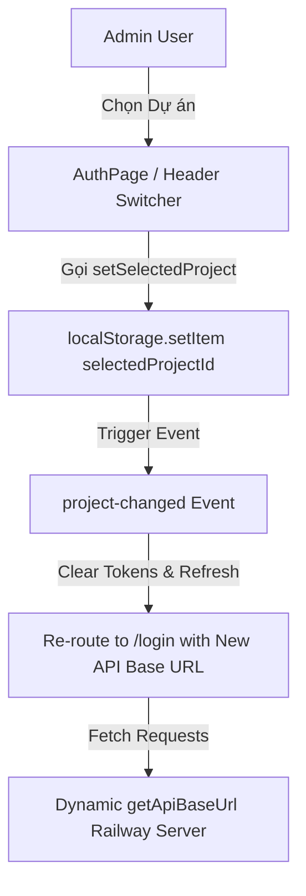

# 🏛️ Architecture & Component Design - MiniApp Portal Dashboard

## 1. Tổng quan Kiến trúc Mã nguồn

Dự án Dashboard được xây dựng bằng **React 19 + Vite + Ant Design 5 (Theme Dark)** theo mô hình Component-Based kết hợp với **Custom API Service Layer (`api.js`)**.

```
miniapps_dashboard/
├── src/
│   ├── assets/              # Logo và hình ảnh tĩnh
│   ├── components/          # Các Tab và Màn hình Chức năng chính
│   │   ├── AuthPage.jsx            # Màn hình Đăng nhập / Đăng ký + Switcher Dự án
│   │   ├── DashboardLayout.jsx     # Shell Bọc ngoài (Sidebar + Header + Project Switcher)
│   │   ├── DashboardTab.jsx        # Trang Tổng quan Thống kê (Overview & Plots)
│   │   ├── CategoryTab.jsx         # Tab Quản lý Nhóm Mini App (Categories)
│   │   ├── MiniAppTab.jsx          # Tab Quản lý Chi tiết Mini Apps & Workspace
│   │   ├── AppMenuTab.jsx          # Tab Quản lý Menu Điều hướng Portal FE
│   │   ├── AccountMenuTab.jsx      # Tab Quản lý Menu Trang Cá nhân (Account)
│   │   ├── UserTab.jsx             # Tab Quản lý Người dùng Quản trị & Phân quyền
│   │   ├── ScriptTab.jsx           # Tab Quản lý SDK Bridge Scripts
│   │   └── ModerationLogTab.jsx    # Tab Nhật ký Kiểm duyệt Bản build
│   ├── services/
│   │   └── api.js                  # Custom Fetch Wrapper & Multi-Project API Switching
│   ├── App.jsx                     # Router chính & Context Theme Ant Design
│   └── main.jsx                    # Application Entry Point
```

---

## 2. Luồng Chuyển đổi Dự án Đa môi trường (Multi-Project Switching)

Hệ thống lưu vết ID dự án đang chọn (`365trade` hoặc `homebooking`) trong `localStorage` qua chìa khóa `selectedProjectId`.



### Các Endpoints Được Cấu hình Dynamic:
- **365Trade**: `https://365trademiniappapidev-production.up.railway.app/api`
- **HomeBooking**: `https://homebookingminiappapidev-production.up.railway.app/api`

---

## 3. Cơ chế Xác thực & Refresh Token Tự động

1. **Access Token**: Được lưu ở `localStorage` và gửi kèm dưới dạng `Authorization: Bearer <token>` trong từng HTTP Header request.
2. **401/403 Handling**:
   - Khi API trả về lỗi hết hạn Token (401/403), `customFetch()` tự động gọi endpoint `/auth/refresh` với `refreshToken`.
   - Nếu Refresh thành công, cập nhật Token mới vào `localStorage` và thực hiện **Retry** lại request ban đầu một cách mượt mà mà không gián đoạn thao tác người dùng.
